# Node.js LLM Engineering Toolkit

A modern, high-performance, flat-structured TypeScript template designed for doing LLM engineering inside the Node.js ecosystem. It features **Express 5** (with native async error support), **Zod v4** (for robust request schema validation), **Vitest/Supertest** (for fast API testing), and **Pino** (for structured JSON logging ready for observability).

Our core integrations establish connections to LLMs using the OpenAI SDK, counting and estimating tokens locally, calculating inference costs, configuring advanced parameters (like structured schema outputs, callback-based streaming, and cutoff limits), and invoking local tools/functions dynamically.

---

## Prerequisites

Before running the project, ensure you have the following installed on your system:
- **Node.js**: `v20.0.0` or higher (recommended: `v22.16.0` or higher)
- **npm**: `v10.0.0` or higher

---

## Quick Start

### 1. Install Dependencies
Run the following command to install the required packages:
```bash
npm install
```

### 2. Configure Environment Variables
Copy the environment template file:
```bash
cp .env.example .env
```
Open the newly created `.env` file and add your credentials:
```env
PORT=3000
NODE_ENV=development
LOG_LEVEL=info
OPENROUTER_API_KEY=your_openrouter_api_key_here
```

#### Optional: Local Ollama Setup (Inference & Embeddings)
To run inference and/or embeddings fully locally using Ollama:
1.  **Install Ollama**: Download and install it from [ollama.com](https://ollama.com).
2.  **Pull Required Models**:
    ```bash
    # For RAG Embeddings (e.g. bge-large)
    ollama pull bge-large
    
    # For LLM Inference (e.g. llama3.2)
    ollama pull llama3.2
    ```
3.  **Update `.env` Configuration**:
    ```env
    # Embedding Settings
    EMBEDDING_PROVIDER=ollama
    EMBEDDING_MODEL=bge-large
    EMBEDDING_DIMENSIONS=1024
    
    # Inference Settings
    INFERENCE_PROVIDER=ollama
    INFERENCE_MODEL=llama3.2
    
    OLLAMA_BASE_URL=http://localhost:11434
    ```

### 3. Run in Development Mode
Start the live-reloading dev server powered by `tsx`:
```bash
npm run dev
```
The server will start listening on [http://localhost:3000](http://localhost:3000).

### 4. Run the Tests
Verify the code works correctly using Vitest:
```bash
npm run test
```

### 5. Build for Production
To compile the TypeScript code to JavaScript:
```bash
npm run build
npm start
```
Compiles and bundles the output directly into `/dist`.

---

## Core Technologies & Scripts

- **Express 5**: Native async handling.
- **Zod v4**: Fast schema validation.
- **Pino**: High-performance structured JSON logging.
- **Vitest & Supertest**: Developer-friendly API and request unit testing.
- **TSX**: Modern and fast TypeScript runner (watch-mode enabled).
- **HNSWLib (`hnswlib-node`)**: Core approximate nearest neighbor (ANN) vector indexing.
- **Orama Search Index (`@orama/orama`)**: Memory-resident keyword/full-text search.
- **Better-SQLite3 (`better-sqlite3`)**: Relational database adapter for chunk metadata persistence.
- **Xenova Transformers (`@xenova/transformers`)**: Fast in-memory local ONNX feature extraction embeddings.
- **Commander & Inquirer**: Premium command line parsing and interactive console prompt dashboard UI.

### Available Scripts & CLI Usage

You can run various operations using the pre-configured npm scripts. Below are the execution and configuration options for each script:

*   **Run Development Server**:
    ```bash
    npm run dev
    ```
*   **Run Tests**:
    ```bash
    npm run test
    ```
*   **Launch Interactive CLI Menu**:
    ```bash
    npm run cli
    ```
    Launches a gamified interactive terminal dashboard to seamlessly switch between running lessons, triggering ingestions, querying the index, and running evaluations.
*   **Ingest Knowledge Base**:
    ```bash
    npm run ingest
    ```
    Clears local index caches and runs the dual-stage context-aware markdown chunking pipeline on the `knowledge-base/` folder.
*   **Search Hybrid Index**:
    ```bash
    npm run retrieve -- "[query]"
    ```
    Searches the combined Orama and HNSW indices using Reciprocal Rank Fusion (RRF), displaying the top-5 hydrated SQLite metadata matches inside formatted terminal cards.
*   **Evaluate Retrieval Engine**:
    ```bash
    # Run evaluation on all 150 test questions (will prompt interactively)
    npm run eval
    
    # Run evaluation for a single question index
    npm run eval -- --mode single --index 9
    
    # Run evaluation for a range of question indices
    npm run eval -- --mode range --start 1 --end 10
    ```

---

## API Endpoints

- **`GET /`**: Welcome route showing `welcome to LLM_ENGINEERING WITH NODEJS`.
- **`GET /docs`**: Interactive Swagger API documentation UI.
- **`GET /health`**: Health status indicator.
- **`POST /echo`**: Echoes input messages (validates that `message` is present and non-empty using Zod).

---

## Lesson 1: Connecting to LLMs (OpenAI SDK & OpenRouter)

This lesson demonstrates how to initialize and configure the OpenAI SDK client to connect to language models via OpenRouter, send a prompt, and handle the chat completion response.

View the complete implementation code here: [LESSON_01.ts](LESSON_01.ts)

### How to Run

You can launch the lesson interactively in two ways:

1.  **Using NPM script**:
    ```bash
    npm run lesson 1
    ```
2.  **Running the lesson file directly** (via TSX):
    ```bash
    npx tsx LESSON_01.ts
    ```

### Interactive Features

When you run a lesson, the universal runner guides you through a gamified learning experience:
*   **Step-by-Step Walkthrough**: View lesson descriptions, conceptual explanations, and agnostic code snippets in visually structured cards.
*   **Live Parameter Customization**: Interactively configure lesson arguments (e.g. entering a custom prompt) or press `Enter` to use the lesson defaults.
*   **Auto-Save & Checkpoints**: Your progress is automatically saved at every major step.
*   **Graceful Exit**: You can type `exit` at any interactive prompt to save your session. The next time you start the lesson, you will be prompted to resume where you left off.
*   **Agnostic Core Functions**: Core execution logic is completely decoupled from the runner UI, allowing functions to be cleanly imported, reused, and shared across lessons.

---

## Lesson 2: Tokens, Estimation, and Cost Calculation

This lesson demonstrates how LLM costs are calculated and billed based on "tokens". It teaches you how to estimate token counts offline, retrieve actual billing metadata from the API response, and compare estimated vs. actual execution charges.

View the complete implementation code here: [LESSON_02.ts](LESSON_02.ts)

### How to Run

You can launch the lesson interactively in two ways:

1. **Using NPM script**:
    ```bash
    npm run lesson 2
    ```
2. **Running the lesson file directly** (via TSX):
    ```bash
    npx tsx LESSON_02.ts
    ```

### Key Highlights
*   **Local Token Estimation**: Uses the lightweight `js-tiktoken` library to encode prompts locally and estimate input and output tokens offline for free.
*   **Actual Usage Tracking**: Inspects the raw OpenRouter completion response payload to extract exact token statistics.
*   **Cost Projection**: Performs dynamic cost calculations (in USD) using rates for Gemini 2.5 Flash on OpenRouter, alongside a price comparison if the same prompt had been run on GPT-4o.

---

## Lesson 3: Advanced Inference Options (Zod Schema, Streaming & Constraints)

This lesson explores several advanced inference options, reusing the decoupled `runInference` function from Lesson 1:
1. **Multishot Prompting vs. Structured Outputs**: Compares few-shot system instructions with the OpenAI SDK's built-in Zod-validated `response_format` structures.
2. **Streaming vs. Non-Streaming**: Triggers streaming outputs via a decoupled callback parameter (`streamCb`), demonstrating how to dynamically handle chunk deliveries.
3. **Token Limit Constraints**: Shows how to enforce output limitations using `max_tokens` (or `max_completion_tokens`) and inspect completion metadata (`finish_reason` and token usage logs).

View the complete implementation code here: [LESSON_03.ts](LESSON_03.ts)

### How to Run

You can launch the lesson interactively in two ways:

1. **Using NPM script**:
    ```bash
    npm run lesson 3
    ```
2. **Running the lesson file directly** (via TSX):
    ```bash
    npx tsx LESSON_03.ts
    ```

### Selecting Modes

When configuring the lesson arguments inside the interactive terminal, you can specify one of the following modes:
*   `structured` (Default) - Runs Zod-backed JSON schema extraction.
*   `multishot` - Performs JSON extraction using manual prompt examples.
*   `streaming` - Outputs words in real-time as they stream from the API.
*   `token_limit` - Enforces a maximum token boundary and logs completion reasons.

---

## Lesson 4: Tool Calling (Function Calling) & LLM Agents

This lesson introduces "tools" (function calling) which empower models to request execution of local client-side functions, enabling them to query databases, write files, or perform dynamic computations. Here, we build an agent that manages a hosted stateful Todo list through a terminal interactive REPL loop.

View the complete implementation code here: [LESSON_04.ts](LESSON_04.ts)

### How to Run

You can launch the lesson interactively in two ways:

1. **Using NPM script**:
    ```bash
    npm run lesson 4
    ```
2. **Running the lesson file directly** (via TSX):
    ```bash
    npx tsx LESSON_04.ts
    ```

### Key Highlights
*   **Tool Schema Definitions**: Shows how to structure tools as functions with parameters defined using standard JSON schema definitions.
*   **Agnostic Code & Execution Mapping**: Implements a modular `handleToolCalls` handler that automatically executes requested actions and routes execution outcomes back to the assistant in a unified chat history.
*   **Interactive Terminal REPL**: Launches a live terminal interface where you can chat naturally with the agent (e.g. *"add buy groceries"* or *"mark task 1 as done"*), seeing the local function triggers and updating/rendering an ASCII table in real time.

---

## Lesson 5: Designing and Optimizing a Hybrid RAG Retrieval Engine

This lesson documents the design, implementation, and tuning of a production-ready **Hybrid Retrieval-Augmented Generation (RAG) Engine** from scratch. It builds upon the core AI and tooling skills from Lessons 1–4, shifting the focus to high-performance document indexing, vector searches, full-text inverted indexes, and retrieval evaluation.

### How We Achieved Our Current Design

To build a decoupled and highly testable retrieval system, we established an abstract interface architecture (`interfaces.ts`) and constructed three dedicated storage adapters:
1.  **Relational Metadata Store (`sqlite_database.ts`)**: Powered by `better-sqlite3`. It indexes rich metadata (like file names, relative paths, sizes, and timestamps) and serializes complex parsed Markdown objects (tables, lists) as JSON strings.
2.  **Full-Text Inverted Index (`orama_index.ts`)**: Utilizes `@orama/orama` v3 to handle token-based full-text keyword matching on `contentText`, `docName`, and `docRelativePath`.
3.  **Dense Vector Index (`hnsw_index.ts`)**: Uses `hnswlib-node` to index high-dimensional embeddings (1024-dimensional vectors from a local or hosted `bge-large` model) using `cosine` distance metrics, mapping neighbor positions directly back to SQLite primary keys (`sqliteId`).
4.  **RAG Resource Manager (`rag_resources.ts`)**: Implements a singleton manager to keep active database connections, vector stores, and model loaders warm throughout the CLI and server runtime.

At query time, the system performs parallel retrievals across both Orama and HNSWLib, fusing their ranking candidates using **Reciprocal Rank Fusion (RRF)**:
$$RRF(d) = \sum_{m \in M} \frac{1}{60 + \text{rank}_m(d)}$$
The top candidate chunks are then hydrated directly from SQLite and returned as structured search snippets.



```mermaid
flowchart TD
    %% Ingestion Flow
    subgraph Ingestion Pipeline
        Source[Source Markdown Files] --> Parser[Markdown Element Parser]
        Parser --> Merger[Context-Aware Heading Merger]
        Merger --> Chunker[Dual-Stage Chunker]
        
        Chunker --> DB_Ins[SQLite Insert]
        Chunker --> Embed[Ollama bge-large Embedder]
        
        DB_Ins --> SQL_DB[(SQLite DB)]
        Embed --> HNSW_Ins[HNSW Vector Index Insert]
        HNSW_Ins --> HNSW_DB[(HNSW Index)]
        
        Merger --> Orama_Ins[Orama Index Insert]
        Orama_Ins --> Orama_DB[(Orama Index)]
    end

    %% Retrieval Flow
    subgraph Retrieval Pipeline
        Query[Search Query] --> Prefix[BGE Query Prefixing]
        Query --> Keyword_Search[Orama Keyword Search]
        Prefix --> Dense_Search[HNSW Vector Search]
        
        Keyword_Search --> Candidates_K[Top 30 Keyword Candidates]
        Dense_Search --> Candidates_V[Top 30 Vector Candidates]
        
        Candidates_K & Candidates_V --> RRF[Reciprocal Rank Fusion]
        RRF --> RRF_Sort[Sorted Top 10 Candidates]
        RRF_Sort --> SQLite_Hydration[SQLite Node Hydration]
        SQLite_Hydration --> RAG_Output[Final Hydrated Snippets]
    end
```

### Key Engineering Challenges & Solutions

During evaluation, our retrieval pipeline originally performed below expectations. Through systematic diagnostics, we identified and solved three core RAG issues:

*   **Challenge 1: Vector Space Desynchronization & Model Alignment**
    *   *Issue*: Cosine similarity searches returned near-orthogonal results, leaving target documents outside the top 50 retrieved items.
    *   *Diagnosis*: The `bge-large` model family requires specific instruction prefixes for query vectors to align them with indexed passage vectors.
    *   *Solution*: We updated `rag_retrieve.ts` to automatically detect BGE models and prepend the required query prefix:
        ```typescript
        let embedQuery = query;
        if (config.EMBEDDING_MODEL.toLowerCase().includes('bge')) {
          embedQuery = `Represent this sentence for searching relevant passages: ${query}`;
        }
        ```
*   **Challenge 2: Stopword Noise Pollution in Keyword Search**
    *   *Issue*: On direct questions, Orama keyword searches were dominated by documents that did not contain the actual answer but frequently used common helper words (e.g. `"is"`, `"where"`, `"the"`).
    *   *Diagnosis*: Without stopwords filtering, common query terms generated high BM25 term scores, crowding out target documents containing rare search keywords like `"headquarters"`.
    *   *Solution*: We integrated a robust custom stopword list into Orama's tokenizer configuration at initialization:
        ```typescript
        this.db = create({
          schema: { ... },
          components: {
            tokenizer: {
              stopWords: ENGLISH_STOPWORDS, // 100+ standard English stopwords
            },
          },
        });
        ```
*   **Challenge 3: Information Loss on Chunk Boundaries (Heading/Detail Split)**
    *   *Issue*: For questions querying section titles (e.g., *"What is Insurellm's vision statement?"*), the system failed to retrieve the text details.
    *   *Diagnosis*: Naive markdown parsing split headings and paragraphs into separate chunks. The detail paragraph lost its heading context ("Vision Statement" / "Insurellm") and was unretrievable, while the heading chunk contained no details.
    *   *Solution*: We added **Context-Aware Heading Merging** in `rag_ingest.ts`. During parsing, when the pipeline encounters a markdown section heading, it automatically merges it with its immediate succeeding paragraph, list, or table element:
        ```typescript
        if (el.type === 'heading' && i + 1 < rawElements.length && rawElements[i + 1].type !== 'heading') {
          const nextEl = rawElements[i + 1];
          elements.push({
            ...el,
            text: `${el.text}\n${nextEl.text}`,
            raw: `${el.raw}\n${nextEl.raw}`,
            // Merge other metadata...
          });
          i++;
        }
        ```

### Final Retrieval Evaluation Benchmarks (150 Questions)

Following the implementation of these optimizations, a full evaluation run on the golden dataset of 150 questions demonstrated significant performance improvements:
*   **Mean Reciprocal Rank (MRR)**: `0.6828`
*   **Mean nDCG**: `0.7202`
*   **Keyword Coverage**: `91.49%` (344 / 376 keywords found in retrieved snippets)
*   **Mean Item Coverage**: `91.82%`

#### Performance Breakdown by Category
*   **`temporal` (`0.7948` MRR / `0.8180` nDCG)**: Highly distinct date/timeline keywords yield near-perfect retrieval.
*   **`numerical` (`0.7458` MRR / `0.7861` nDCG)**: Accurate numerical matching across contracts.
*   **`direct_fact` (`0.7041` MRR / `0.7411` nDCG)**: Facts successfully routed to top ranks due to stopword filtering and heading merging.
*   **`spanning` (`0.5487` MRR / `0.6107` nDCG)**: Solid retrieval quality considering that spanning queries target information distributed across multiple document regions.

